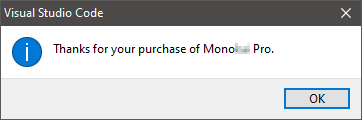

# mononucleosis-pro
Generates keys for an aptly named **color scheme**?


`Press F to pay respects`

## Instructions

### Sublime Text 3
* Open *Sublime Text 3* and ensure you have `Theme - <package name>` installed
* Open up the user preferences for the theme `(Preferences > Package Settings > Theme - <package name> > Settings - User)`
* Copy the following text into the file, with the placeholder values changed appropriately

```json
{
    "email": "{add your email here}",
    "license_key": "{add your license key here}"
}
```

* Save the file and restart *Sublime Text 3*
* You should see a thank you pop-up message and you are now running an activated theme.


### Visual Studio Code
* Open *Visual Studio Code* and ensure you have `<package name>` installed.
* Press `Ctrl+Shift+P` to open the command palette.
* Search for `<package name>` and select the option `<package name> - enter license.`
* Follow the prompts on-screen to enter your email and license key.
* You should see a thank you pop-up message and you are now running an activated theme.



